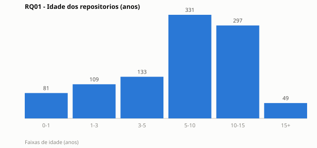
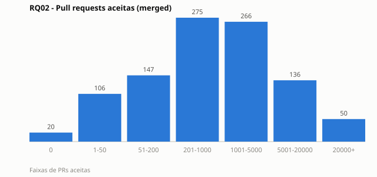
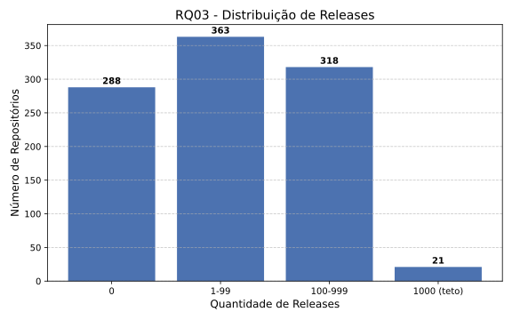
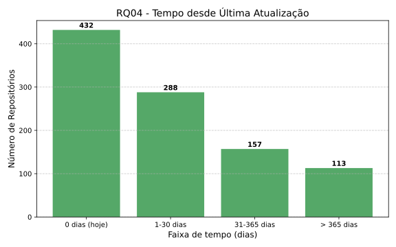
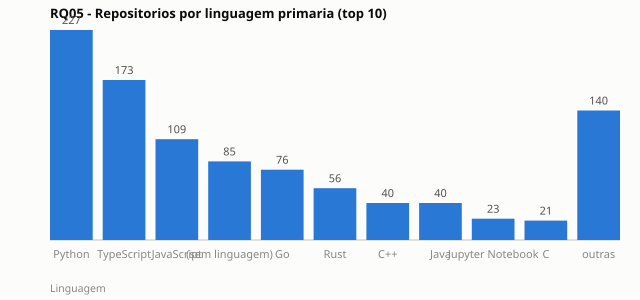
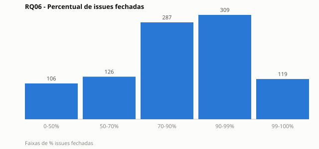
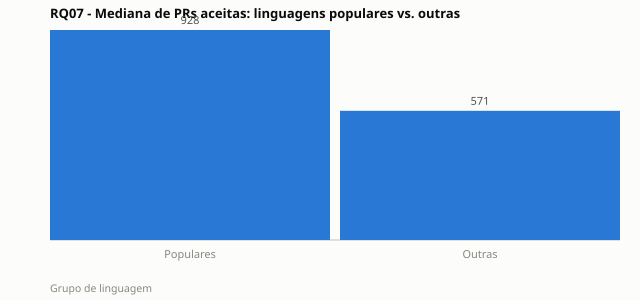
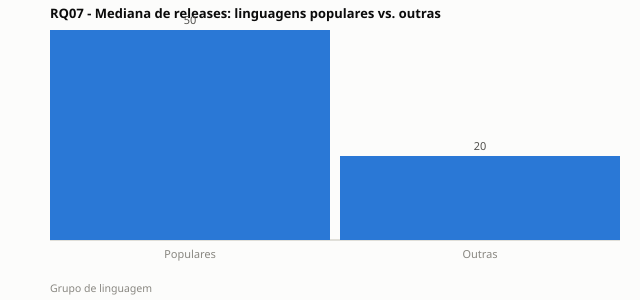
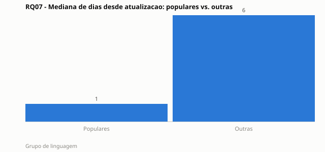

# Relatório de Laboratório

| Campo | Valor |
|---|---|
| **Curso** | Engenharia de Software |
| **Disciplina** | Laboratório de Experimentação de Software |
| **Turno / Período** | Noite / 6º |
| **Professor(a)** | Danilo Maia |
| **Laboratório** | Lab01: Características de repositórios populares + Setup do Kanban |
| **Grupo (trio)** | Gabriel Chagas · Guilherme Lana · Marcus Vinicius |
| **Link do repositório / GitHub Projects** | https://github.com/gabrielchagas13/lab-exp-de-software-turma-02-grupo-06 |
| **Data de entrega** | 26/08/2026 |

---

## 1. Introdução

Sistemas populares no GitHub acumulam estrelas por razões nem sempre óbvias: maturidade e comunidade consolidada, atividade constante de manutenção, ou simplesmente um pico de popularidade recente e passageiro. Entender quais dessas explicações de fato se sustentam nos dados importa tanto para quem avalia a saúde de um projeto open-source quanto para quem decide, na prática, qual dependência adotar. Este laboratório investiga sete características de repositórios populares, cada uma com uma hipótese informal levantada **antes** da coleta e análise dos dados, para os 1.000 repositórios com maior número de estrelas do GitHub.

Questões de pesquisa do enunciado e hipóteses informais do grupo:

- **RQ01: Sistemas populares são maduros/antigos?** Hipótese: sim, repositórios populares tendem a ser maduros, pois é necessário tempo para acumular estrelas e comunidade.
- **RQ02: Sistemas populares recebem muita contribuição externa?** Hipótese: sim, medida pelo total de pull requests aceitas.
- **RQ03: Sistemas populares lançam releases com frequência?** Hipótese: sim, por serem mantidos por empresas/fundações com pipelines de CI/CD.
- **RQ04: Sistemas populares são atualizados com frequência?** Hipótese: sim, pois engajamento ativo tende a atrair e reter estrelas.
- **RQ05: Sistemas populares são escritos nas linguagens mais populares?** Hipótese: sim, alinhado ao ranking geral de linguagens mais usadas no mercado (fonte: GitHub Octoverse).
- **RQ06: Sistemas populares possuem alto percentual de issues fechadas?** Hipótese: sim, pois teriam mais mantenedores/contribuidores ativos.
- **RQ07: Sistemas em linguagens mais populares recebem mais contribuição, lançam mais releases e são atualizados com mais frequência?** Hipótese: sim, repositórios em linguagens populares (Octoverse) devem superar os demais nas métricas de RQ02, RQ03 e RQ04.

Além do enunciado, o grupo propõe duas frentes de inovação (30% da nota, detalhadas na Seção 3.6):

- **(a)** Um controle de qualidade de dados que identifica e documenta um teto de contagem de 1000 na API GraphQL do GitHub para `releases.totalCount`, corrigindo a leitura da RQ03.
- **(b)** Um "mapa do ecossistema", visualização em grafo de força dos 990 repositórios, agrupados por linguagem primária e dimensionados por estrelas, aprofundando a leitura visual da RQ05.

---

## 2. Contexto

Este é o **Lab01** do semestre, o primeiro de cinco, responsável por estabelecer tanto a base de dados (mineração via GraphQL) quanto o processo (GitHub Projects) que acompanharão o grupo até o Lab05. Os snapshots do board exportados a partir deste laboratório (Seção 3.3) serão a base de dados dos Labs 04 e 05, já que a API do GitHub Projects não permite consultar histórico de mudança de coluna.

O objeto de estudo são os **1.000 repositórios com maior número de estrelas no GitHub**, ordenados via `search(sort:stars-desc)` na própria API GraphQL, a mesma ordenação usada na busca web do GitHub.

Fonte de referência adotada para "linguagens mais populares" (RQ05 e RQ07), mantida consistente do início ao fim do laboratório: **GitHub Octoverse** (https://octoverse.github.com). Top 10 considerado: JavaScript, Python, Java, TypeScript, C#, C++, PHP, Shell, C, Ruby.

---

## 3. Metodologia

### 3.1 Principais Desafios

- **Teto de contagem da API:** o campo `releases.totalCount` satura em exatamente 1000 para projetos com histórico muito extenso (ex.: `pnpm/pnpm`, `home-assistant/core`, `langchain-ai/langchain`). A ocorrência do mesmo valor redondo em 21 repositórios independentes não é coincidência, é evidência de um teto de contagem da própria API GraphQL do GitHub. Nesses casos, o valor real deve ser lido como "≥ 1000", não como total exato.
- **Timeout de gateway em paginação profunda:** a consulta que inclui `releases.totalCount` é computacionalmente cara para a API; ao coletar 1000 repositórios, o gateway do GitHub retornou 502/504 persistentemente após a página ~990, mesmo com retry/backoff exponencial. O dataset principal fechou em **990/1000**.
- **Ausência de histórico de status consultável no GitHub Projects:** a API não permite consultar mudanças de coluna retroativamente, resolvido com snapshots recorrentes exportados ao final de cada sprint.

### 3.2 Tomadas de Decisão

- **Critério de amostragem:** busca por `stars:>1 sort:stars-desc`, paginada via cursor (`pageInfo.hasNextPage`/`endCursor`), replica exatamente a ordenação da busca web do GitHub, sem heurística própria de corte.
- **Dataset duplo para RQ01/RQ02:** como a query completa (com `releases`) trava perto de 990/1000, um dataset auxiliar sem esse campo foi gerado à parte, fechando 1000/1000 para essas duas métricas específicas.
- **Dados ausentes tratados como categoria, não erro:** repositórios sem `primaryLanguage` (8,6% da amostra) ou sem nenhuma release são estados válidos retornados pela própria API, mantidos como categoria/nulo explícito, nunca descartados ou zerados indevidamente.
- **Limite de WIP:** **[pendência do grupo, a justificar antes da entrega final]**. A coluna Doing ainda não tem um limite de WIP formalmente documentado; decisão em aberto.

### 3.3 Etapas

| Sprint | Entregas | Responsável(is) | Issues |
|---|---|---|---|
| Lab01S01 | Consulta GraphQL (100 repositórios) + GitHub Projects criado (colunas + WIP) | Marcus (RQ01/RQ02 + script base), Guilherme (RQ03/RQ04 + integração + execução para 100), Gabriel (Projects + RQ05/RQ06/RQ07) | #1–#11 |
| Lab01S02 | Paginação (1000 repositórios) + CSV + 1ª versão do relatório + snapshot do board | Marcus (#12, #13), Guilherme (#14, #15), Gabriel (#16, #17) | #12–#17 |
| Lab01S03 | Análise e visualização das 7 RQs | Marcus (#19, #20), Guilherme (#21, #22), Gabriel (#23, #24) | #19–#24 |
| Relatório Final | Documento final consolidado | Todo o grupo | - |

**Configuração do processo:** board **GitHub Projects (v2)**, "KANBAN - Lab Grupo 06", vinculado ao repositório do grupo. Colunas de status: `Backlog → To Do → Doing → Review → Done` (mínimo exigido pelo enunciado). Limite de WIP: pendente de justificativa formal (ver 3.2). Snapshots de fechamento de sprint exportados via `scripts/fetch_project_snapshot.py` (ex.: `data/snapshot_lab01s02.csv`).

*[Inserir aqui a captura de tela do board ao final do laboratório, mostrando o fluxo real de trabalho do grupo e a política de WIP em uso.]*

### 3.4 Ferramentas

- **Coleta:** API GraphQL do GitHub (`https://api.github.com/graphql`), script Python próprio do grupo, sem bibliotecas de terceiros de acesso à API, conforme exigido pelo enunciado.
- **Processamento e análise:** Python (stdlib, `csv`, `statistics`), sem pandas.
- **Visualização:** SVG e Canvas gerados programaticamente para RQ01, RQ02, RQ05, RQ06, RQ07 e para o mapa do ecossistema (sem Plotly/D3); Matplotlib para os gráficos de RQ03 e RQ04.
- **Processo:** GitHub Projects (v2), repositório do grupo em https://github.com/gabrielchagas13/lab-exp-de-software-turma-02-grupo-06.

### 3.5 Tabela de Métricas

| RQ | Métrica | Definição Operacional | Unidade | Ferramenta / Fonte |
|---|---|---|---|---|
| RQ01 | Idade do repositório | Data da coleta − `createdAt` | Anos | Script GraphQL (API do GitHub) |
| RQ02 | Pull requests aceitas | `pullRequests(states: MERGED).totalCount` | Contagem | Script GraphQL |
| RQ03 | Total de releases | `releases.totalCount` | Contagem | Script GraphQL |
| RQ04 | Tempo até a última atualização | Data da coleta − `pushedAt` | Dias | Script GraphQL |
| RQ05 | Linguagem primária | `primaryLanguage.name`, comparado ao top 10 do GitHub Octoverse | Categoria | Script GraphQL + Octoverse |
| RQ06 | Percentual de issues fechadas | `closed_issues / (open_issues + closed_issues)` | Razão (0–1) | Script GraphQL |
| RQ07 | Cruzamento por linguagem | Mediana de RQ02/RQ03/RQ04, agrupada por "linguagem popular" (Octoverse) vs. "outras" | Comparativo | Derivado dos dados acima |

### 3.6 Inovações Propostas pelo Grupo (30% da nota)

**(a) Controle de qualidade de dados, teto de contagem da API.** Identificamos e documentamos que `releases.totalCount` satura em exatamente 1000 para 21 repositórios (2,1% da amostra), incluindo projetos com histórico comprovadamente maior, como `home-assistant/core` e `langchain-ai/langchain`. Em vez de tratar isso como ruído, incorporamos a ressalva "≥ 1000" na leitura de RQ03 e no cálculo de RQ07, evitando subestimar releases desses projetos como se fossem exatamente 1000. O resultado aparece na Discussão da RQ03 (Seção 4.3) e na tabela de faixas da RQ03 (Seção 4.2).

**(b) Mapa do ecossistema, clusterização visual por linguagem (RQ05 × RQ07).** Em vez de resumir a RQ05 só em barras, construímos uma visualização em **grafo de força** (simulação física em Canvas, sem bibliotecas externas) onde cada um dos 990 repositórios é um ponto agrupado por linguagem primária, com o tamanho do ponto proporcional às estrelas e arestas conectando repositórios vizinhos da mesma linguagem. O resultado dá uma leitura visual imediata de como Python e TypeScript dominam em volume, e de como poucos "gigantes" isolados (ex.: `freeCodeCamp/freeCodeCamp`) distorcem o tamanho médio de um cluster inteiro, reforçando a leitura da Discussão da RQ05 (Seção 4.3). Disponível em `dashboard.html` (interativo, animado, tema claro/escuro).

---

## 4. Resultados

### 4.1 Coleta de Dados

Volume final: **990 de 1000** repositórios-alvo no dataset principal (`data/repos_1000.csv`), por conta do timeout de gateway descrito na Seção 3.1. Um dataset auxiliar sem o campo de releases (`data/repos_rq1_rq2_1000.csv`) fechou **1000/1000** para RQ01/RQ02, usado como checagem cruzada. Nenhum valor ausente foi descartado: repositórios sem linguagem primária (8,6%, RQ05) ou sem nenhuma issue (4,3%, divisão por zero em RQ06) foram mantidos como categoria/nulo explícito, não removidos da amostra. Nenhuma duplicata foi encontrada em nenhuma das sete métricas.

### 4.2 Visualização Gráfica

**RQ01: A idade dos repositórios está concentrada em quantos anos?**
Mediana: **7,75 anos**. Histograma por faixa de idade (n = 1000):

**RQ02: Quantas pull requests aceitas os repositórios mais estrelados recebem?**
Mediana: **768 PRs aceitas** (média 4.236,5, distribuição fortemente assimétrica). Histograma por faixa (n = 1000):

**RQ03: Repositórios lançam releases com que frequência?**
Mediana: **38 releases** entre quem usa o mecanismo. Histograma por faixa (n = 990):

**RQ04: Com que frequência os repositórios são atualizados?**
Mediana: **2 dias** desde a última atualização. Histograma por faixa (n = 990):

**RQ05: Quais linguagens dominam entre os repositórios mais estrelados?**
Python, TypeScript e JavaScript somam **51,4%** da amostra. Ranking de barras por linguagem, top 10 (n = 990):

**RQ06: Qual o percentual de issues fechadas nos repositórios populares?**
Mediana: **87,6%**. Histograma por faixa de % issues fechadas (n = 947, excluindo 43 repositórios sem nenhuma issue):

**RQ07: Linguagens populares (Octoverse) recebem mais contribuição, releases e atualizações que as demais?**
Barras comparativas de mediana por grupo (populares n = 655 vs. outras n = 335):

**Inovação (b): Mapa do ecossistema.** Grafo de força com os 990 repositórios agrupados por linguagem primária (visualização interativa; ver `dashboard.html`, não reproduzível em imagem estática por ser animada).

*Dados brutos de apoio: `data/rq05_rq06_summary.csv`, `data/rq07_by_language_1000.csv`.*

### 4.3 Discussão

Das 7 hipóteses, **4 foram confirmadas** (RQ02, RQ04, RQ06, RQ07) e **3 parcialmente confirmadas** (RQ01, RQ03, RQ05), nenhuma foi refutada.

- **RQ01** (parcialmente confirmada): mediana de 7,75 anos e 63,7% da amostra com mais de 5 anos indicam maturidade típica, mas 8,1% têm menos de 1 ano, sobretudo ferramentas de IA que viralizaram rápido. Popularidade não exige necessariamente maturidade.
- **RQ02** (confirmada): mediana de 768 PRs aceitas, mas distribuição muito assimétrica (média 5,5× a mediana). `torvalds/linux` aparece com 0 PRs mergeadas, o kernel Linux não usa o fluxo de PR do GitHub (patches via mailing list), evidenciando que a métrica subestima contribuição externa nesse tipo de caso.
- **RQ03** (parcialmente confirmada): entre quem usa o mecanismo de Releases, a frequência é alta (21 repositórios atingem o teto de 1000 da API), mas 29,1% da amostra nunca publicou nenhuma release, tipicamente listas, livros e roadmaps, não "software" no sentido tradicional.
- **RQ04** (confirmada): 43,6% recebeu push no próprio dia da coleta; 75% nos últimos ~49 dias. Uma cauda de 11,4% está inativa há mais de um ano, mantida por valor histórico/educacional, não manutenção ativa.
- **RQ05** (parcialmente confirmada): Python, TypeScript e JavaScript somam 51,4% da amostra (alinhado ao Octoverse), mas Go (7,7%) e Rust (5,7%), fora do top 10, aparecem com peso desproporcional, sugerindo que nichos técnicos (sistemas/infraestrutura) estão sobrerrepresentados nos repositórios mais estrelados frente ao uso geral de mercado.
- **RQ06** (confirmada): mediana de 87,6% de issues fechadas. A cauda inferior (11,2% abaixo de 50%) é dominada por projetos de IA/LLM em crescimento explosivo, volume de issues supera a capacidade de triagem, não é descaso.
- **RQ07** (confirmada): repositórios em linguagens populares têm mediana de PRs 63% maior e de releases 2,5× maior. Efeito não uniforme: Rust e Go, fora do top 10, superam várias linguagens populares (Java, C, Shell) em PRs aceitas, o tipo de ecossistema pode pesar mais que o ranking geral de popularidade da linguagem.

**Padrão geral:** o motivo comum às três hipóteses parcialmente confirmadas é uma **população mista** na amostra, repositórios "software" tradicionais convivem com listas curadas, tutoriais e documentação, que não lançam releases, têm idade recente-viral, ou não têm linguagem de programação primária. Medianas, não médias, foram a medida mais confiável em quase todas as RQs, dada a assimetria forte introduzida por outliers.

**Ameaças à validade:** (i) o teto de contagem da API (releases, e com menor incidência PRs) subestima métricas para os projetos mais extremos; (ii) o dataset de RQ01/RQ02 (1000/1000) e o principal (990/1000) vêm de execuções em momentos ligeiramente diferentes, introduzindo pequena defasagem temporal entre contagens de estrelas; (iii) a classificação "linguagem popular" via Octoverse é um recorte de mercado geral, não específico de projetos open-source de alta visibilidade.

**Contribuição das inovações (30%):** a inovação (a) mudou diretamente a leitura de RQ03, de "poucas releases" para "número real desconhecido, mas ≥ 1000" nos 21 casos de teto. A inovação (b) tornou visualmente explícito, sem depender de tabela, o quanto poucos clusters de linguagem dominam o volume de repositórios populares, aprofundando a leitura da RQ05.

---

## 5. Conclusão

Repositórios populares no GitHub combinam maturidade moderada, contribuição externa desigualmente distribuída e alta taxa de resolução de issues, mas nem sempre são "software" convencional: uma fração relevante da amostra é composta por listas, tutoriais e coleções que não lançam releases nem têm uma linguagem de programação dominante. Linguagens populares (Octoverse) tendem a se sair melhor nas métricas de atividade (RQ07), mas o efeito parece estar mais ligado ao "tipo de ecossistema" (ex.: Rust/Go atraindo comunidades técnicas intensas) do que à popularidade de linguagem isoladamente.

**Limitações do estudo:** amostra de 990–1000 repositórios coletada essencialmente num único instante (sem série temporal); teto de contagem da API do GitHub para métricas de alto volume (releases, PRs); fonte única (Octoverse) para "popularidade de linguagem"; limite de WIP do processo ainda sem justificativa formal documentada (Seção 3.2).

Com mais tempo, o grupo investigaria um recorte temporal, comparar a mesma amostra em datas diferentes, medindo *crescimento* em vez de estado estático, e trataria separadamente, como estratos distintos, os repositórios que são "software" dos que são conteúdo/listas, hipótese que surgiu organicamente durante a validação dos dados e mereceria uma RQ própria em trabalho futuro. Das duas inovações propostas, o mapa do ecossistema (grafo de força) é a que mais valeria a pena expandir, por exemplo, permitindo zoom e filtro por linguagem interativamente.

---

## Referências

- GitHub. *GraphQL API Docs.* Disponível em: https://docs.github.com/graphql, usado para a definição de todos os campos consultados (RQ01–RQ07).
- GitHub. *Octoverse.* Disponível em: https://octoverse.github.com, fonte de referência para "linguagens mais populares" (RQ05, RQ07).
- KALLIAMVAKOU, E.; GOUSIOS, G.; BLINCOE, K.; SINGER, L.; GERMAN, D. M.; DAMIAN, D. The promises and perils of mining GitHub. In: Proceedings of the 11th Working Conference on Mining Software Repositories (MSR), 2014.
