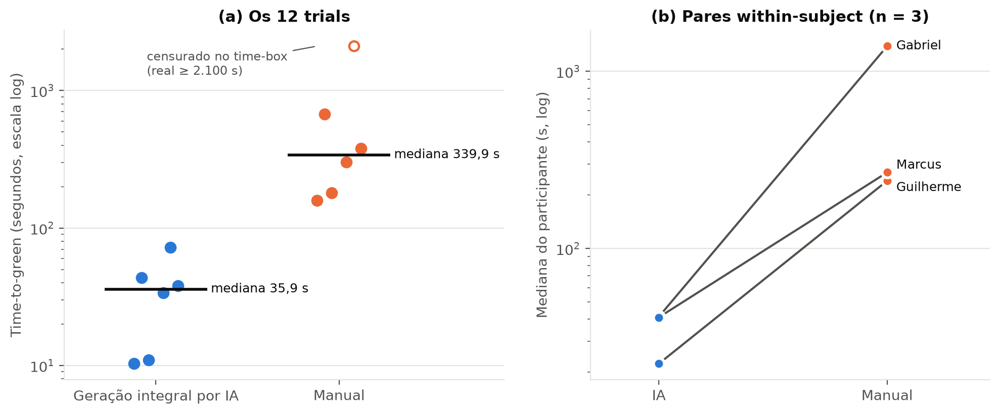
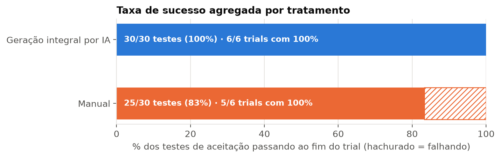
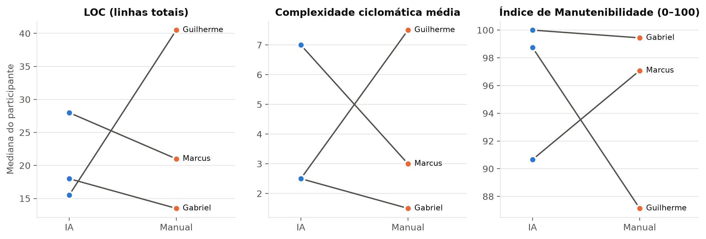
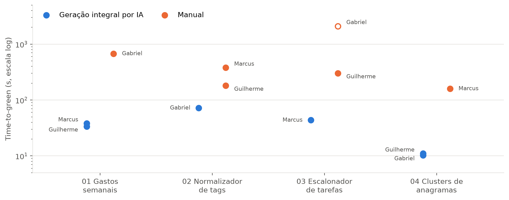
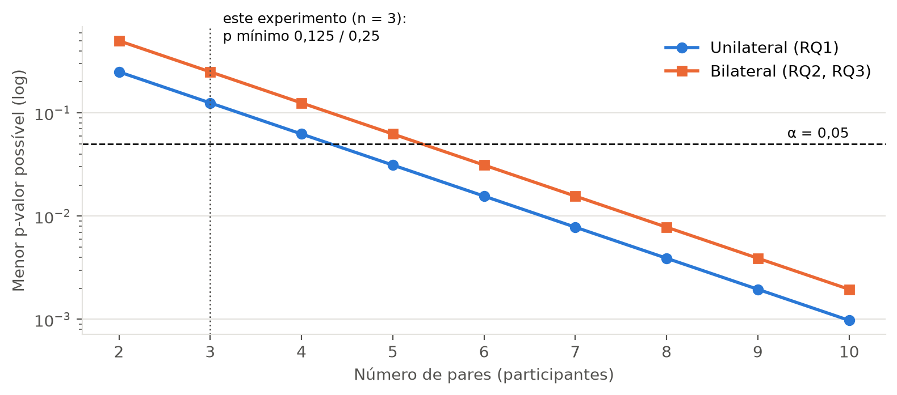

# Relatório de Laboratório

*Laboratório de Experimentação de Software — Relatório Final do Lab02*

| Campo | Valor |
|---|---|
| **Curso** | Engenharia de Software |
| **Disciplina** | Laboratório de Experimentação de Software |
| **Turno / Período** | Noite / 6º |
| **Professor(a)** | Danilo Maia |
| **Laboratório** | Lab02 — Assistentes de IA vs. codificação manual: um experimento controlado |
| **Grupo (trio)** | Gabriel Chagas · Guilherme Lana · Marcus Vinicius |
| **Link do repositório / GitHub Projects** | <https://github.com/gabrielchagas13/lab-exp-de-software-turma-02-grupo-06> (board: "KANBAN - Lab Grupo 06", GitHub Projects v2) |
| **Data de entrega** | 23/09/2026 |

## 1. Introdução

Assistentes de IA generativa (GitHub Copilot, ChatGPT, Claude, Gemini) já fazem parte do dia a dia de quem programa, mas quase tudo o que se diz sobre o seu impacto vem de relatos anedóticos ou de pesquisas de opinião. Há pouca evidência controlada e reproduzível que responda perguntas simples: a IA de fato encurta o tempo para chegar a uma solução correta? O código que ela entrega tem menos defeitos? É mais complexo, mais verboso ou mais duplicado do que o código escrito à mão? Para a engenharia de software a resposta importa porque decisões de adoção de ferramentas, de treinamento e até de avaliação de desempenho estão sendo tomadas com base nessas percepções.

Este laboratório realiza um **experimento controlado, crossover within-subject e time-boxed (35 min por trial)**, em que cada integrante do trio resolve quatro katas de programação autorais, metade à mão e metade com IA. O grupo optou por testar a forma **mais extrema** de uso da IA: a **geração integral** do código pela IA (o participante não escreve o código base; só formula prompts de geração e de correção), contra a codificação manual sem nenhum assistente.

**Questões de Pesquisa do enunciado** (Questions do GQM), na formulação adaptada ao tratamento de geração integral:

- **RQ1 — Tempo:** delegar a geração total do código para a IA reduz o tempo total (geração + correção) necessário para resolver uma tarefa de programação, em comparação à codificação manual?
- **RQ2 — Defeitos:** o código gerado integralmente por IA apresenta mais ou menos defeitos (testes que falham) do que o código feito à mão ao final do time-box?
- **RQ3 — Estrutura do código:** o código gerado por IA apresenta maior complexidade ciclomática, verbosidade (LOC) ou duplicação em comparação ao código desenvolvido manualmente?

**Hipóteses** (definidas antes da coleta, em `scripts/hypotheses.py`, issue #27), com a expectativa informal do grupo:

| RQ | H0 (nula) | H1 (alternativa) | Expectativa informal do grupo |
|---|---|---|---|
| RQ1 | Não há diferença na mediana do time-to-green entre os tratamentos. | A mediana do time-to-green é **menor** no tratamento de geração integral por IA (unilateral). | A IA seria muito mais rápida em katas curtos, desde que não alucinasse. |
| RQ2 | Não há diferença na mediana da taxa de sucesso (% de testes passando) entre os tratamentos. | A mediana da taxa de sucesso **difere** entre os tratamentos (bilateral). | Sem direção definida: a IA poderia errar casos de borda, e o manual poderia não terminar a tempo. |
| RQ3 | Não há diferença na mediana da complexidade ciclomática, do LOC nem da duplicação. | A mediana de pelo menos uma dessas métricas **difere** entre os tratamentos (bilateral). | O código da IA seria mais verboso (mais LOC) e possivelmente mais complexo. |

**Contribuições além do enunciado** (os 30% de inovação, detalhados na Seção 3.6):

- **(a) Metodologia alternativa:** tratamento de *geração integral por IA* (delegação total com correção só por prompt), em vez de uso assistido livre.
- **(b) Métricas adicionais:** SLOC, Índice de Manutenibilidade (Radon `mi`) e uma segmentação exploratória do tempo **por kata**.
- **(c) Ferramenta de coleta própria:** cronômetro automatizado (`timer.py`) que detecta sozinho o "verde" via pytest, censura no time-box, valida o trial contra o plano de contrabalanceamento e arquiva o código de cada trial.
- **(d) Análise estatística complementar:** análise do poder do Wilcoxon (piso do p-valor com n = 3), teste de Mann-Whitney exploratório e análise de sensibilidade ao trial censurado.

## 2. Contexto

**Contexto acadêmico.** Este é o **Lab02**, o segundo de cinco laboratórios do semestre. Diferente do Lab01 (mineração de 1.000 repositórios via API GraphQL), aqui o grupo deixa de observar dados existentes e passa a **produzir os dados por meio de um experimento controlado**. O processo continua sendo gerido no mesmo board GitHub Projects (v2) "KANBAN - Lab Grupo 06" criado no Lab01, que acumula o histórico de Issues que será usado como objeto de estudo nos Labs 04 e 05. O Lab02 foi executado em três sprints entre 07/09/2026 e 23/09/2026.

**Objeto de estudo.** O que se mede é o **processo de resolução de katas de programação** por estudantes de graduação sob duas condições: manual e com geração integral por IA. Os objetos experimentais são quatro katas autorais em Python, cada um com cinco testes de aceitação em pytest:

| # | Kata | Conceito exercitado | Assinatura |
|---|---|---|---|
| 01 | Semana de maior gasto | Agregação / agrupamento | `weekly_spending(purchases) -> (int, float)` |
| 02 | Ranking de tags normalizadas | Normalização de string + contagem | `normalize_tags(tags) -> list[tuple[str, int]]` |
| 03 | Ordem de execução com dependências | Grafo / ordenação topológica com detecção de ciclo | `schedule_tasks(dependencies) -> list[str]` |
| 04 | Agrupamento de anagramas | Hashing / agrupamento | `anagram_clusters(words) -> list[list[str]]` |

**Base teórica.** O objetivo do experimento foi estruturado pelo método **GQM** (Basili, Caldiera & Rombach): *Analisar a delegação total a assistentes de IA generativa na resolução de tarefas de programação, com o propósito de comparar seu efeito frente à codificação manual, com respeito a tempo de resolução, qualidade funcional (defeitos) e qualidade estrutural do código, do ponto de vista do grupo pesquisador, no contexto de katas de dificuldade equivalente resolvidos por estudantes de graduação sob condições controladas.* O desenho segue a terminologia de experimentação em engenharia de software de Wohlin et al. (variáveis dependentes/independentes, tratamentos, objetos, ameaças à validade). As métricas estruturais se apoiam na complexidade ciclomática de McCabe (1976) e no Índice de Manutenibilidade (Coleman et al., 1994), e a análise inferencial usa o teste de postos sinalizados de Wilcoxon (1945) para amostras pareadas, adequado ao desenho within-subject e ao N pequeno. Como referência externa sobre o efeito da IA em produtividade, o grupo considerou o experimento controlado de Peng et al. (2023) com GitHub Copilot.

## 3. Metodologia

### 3.1 Principais Desafios

- **Evitar memorização pela IA.** Katas clássicos (LeetCode, HackerRank, Codewars) provavelmente estão no treinamento dos modelos, e a IA reproduziria uma solução já vista em vez de "resolver" o problema. O grupo escreveu **quatro katas autorais**, não publicados fora do repositório, com a mesma "forma" (função pura, sem I/O, sem bibliotecas externas, 15–30 min de esforço estimado) e conceitos diferentes, para que nenhum participante fosse favorecido por já ter treinado um tipo de problema.
- **Operacionalizar o tratamento com IA de forma comparável.** "Usar IA" admite muitos graus (autocomplete, chat, cópia parcial). Um tratamento vago tornaria os trials incomparáveis entre si. O grupo redefiniu o tratamento como **geração integral**: o participante não escreve o código base e só corrige falhas por novos prompts (regra `TREATMENT_B_RULE` em `scripts/hypotheses.py`). Essa redefinição veio depois do desenho inicial (#30 descrevia uso assistido do Copilot) e exigiu atualizar hipóteses, desenho e plano de trials (commit `ef034e9`).
- **Medir o tempo sem erro humano.** Um cronômetro manual depende de o participante lembrar de parar no momento certo. A solução foi um script que roda o pytest a cada 5 s e para sozinho quando os cinco testes passam, ou censura em 2.100 s.
- **Contrabalancear com N ímpar.** Com 3 participantes e 4 katas não existe distribuição 50/50 por kata. O grupo aceitou 2/1 ou 1/2 por kata, mantendo 2 IA + 2 manual por participante e 6/6 no agregado (Seção 3.2).
- **Integridade dos dados brutos.** Durante a S02, dois trials manuais do Marcus foram gravados com o tratamento errado por digitação no comando. A correção precisou de evidência objetiva e de registro auditável (`data/correcoes.md`), e o `timer.py` passou a validar cada trial contra o plano oficial antes de iniciar.
- **Poder estatístico.** Com três participantes o teste de Wilcoxon pareado tem só 3 pares, e o menor p-valor possível é 0,125 (unilateral). O desafio foi reportar isso corretamente, sem apresentar "não rejeita H0" como "não há efeito" (Seção 4.3).

### 3.2 Tomadas de Decisão

| Decisão | Escolha | Trade-off / justificativa |
|---|---|---|
| Linguagem e ferramenta de métricas | **Python 3 + Radon** (em vez de Java + CK) | Katas e testes já escritos em Python/pytest. Radon cobre LOC, SLOC, complexidade ciclomática e Índice de Manutenibilidade. Custo: Radon não mede duplicação, o que exigiu o jscpd como ferramenta complementar. |
| Tratamento com IA | **Geração integral** (só prompts, sem escrever o código base) | Isola o efeito da IA como "autora" do código e deixa o tratamento sem ambiguidade. Custo: mede um uso extremo, não o uso assistido do dia a dia; os resultados não se generalizam para o autocomplete. |
| Assistente de IA | **Claude (Anthropic), via chat**, o mesmo em todos os trials com IA; modelo/versão: **[preencher]** | A geração integral por prompt pede uma interface de chat que devolva a função inteira, o que o autocomplete inline do Copilot previsto na #30 não oferece. O registro vem do cabeçalho dos arquivos dos trials (`tratamento: IA (Claude)`), porque `docs/ambiente.md` (#30) não foi atualizado após a mudança. |
| Time-box | **35 min (2.100 s)**, sem redução | Mantém a comparabilidade com os outros grupos da turma, conforme o enunciado. |
| Trial não concluído | **Censurado em 2.100 s**, mantido na análise | Descartá-lo favoreceria o tratamento com mais falhas. Como 2.100 s é um piso do tempo real, a diferença entre tratamentos fica subestimada, nunca inflada. |
| Número de katas | **4** (não 6) | Número par que divide exatamente 2 IA + 2 manual por participante e cabe numa sessão. Custo: fica no limite inferior da faixa de 4–6 trials/integrante. |
| Pareamento | **1 par por participante**: mediana dos 2 trials com IA vs. mediana dos 2 manuais | Respeita o desenho within-subject (cada pessoa é o próprio controle). Custo: n = 3 pares. |
| Descritivas e teste | **Mediana e IQR**; **Wilcoxon signed-rank pareado** (unilateral na RQ1, bilateral na RQ2/RQ3), α = 0,05 | N pequeno e um valor censurado dominariam a média; o Wilcoxon é não paramétrico e pareado. |
| Trials piloto | **2 trials do Marcus descartados** (katas 01 e 03, 13h45 e 13h53) | O tempo medido refletia o aprendizado do uso do `timer.py`, não a resolução. Mantidos em disco só como rastro (`data/correcoes.md`). |
| Limite de WIP (coluna Doing) | **[preencher: limite adotado e justificativa]** | [preencher] |

### 3.3 Etapas

| Sprint | Entregas | Responsável(is) | Issues (nº) |
|---|---|---|---|
| **Lab02S01** (07–09/09) | Katas autorais + testes de aceitação; hipóteses H0/H1 e ameaças à validade | Gabriel Chagas | #26, #27 |
| | Script de cronometragem (`timer.py`); desenho experimental e tabela de contrabalanceamento | Marcus Vinicius | #28, #29 |
| | Ambiente e escolha do assistente; script de métricas estáticas (`collect_metrics.py`) | Guilherme Lana | #30, #31 |
| | Revisão conjunta do desenho | Todo o grupo | #32 |
| **Lab02S02** (16/09) | 4 trials: kata 01 (IA), 02 (manual), 03 (IA), 04 (manual) | Marcus Vinicius | #35, #36, #37, #38 |
| | 4 trials: kata 01 (IA), 02 (manual), 03 (manual), 04 (IA) | Guilherme Lana | #39, #40, #41, #42 |
| | 4 trials: kata 02 (IA), 01 (manual), 03 (manual), 04 (IA) | Gabriel Chagas | #43, #44, #45, #46 |
| **Lab02S03** (23/09) | Análise estatística RQ1/RQ2 (Wilcoxon) | Marcus Vinicius | #47 |
| | Análise da RQ3 (métricas estáticas) | Guilherme Lana | #48 |
| | Dashboard de visualização | Gabriel Chagas | #49 |
| **Relatório Final** | Este documento; figuras em `scripts/report_figures.py` | Todo o grupo | #50 |

**Configuração do processo.** Board **GitHub Projects (v2)** "KANBAN - Lab Grupo 06", o mesmo desde o Lab01, vinculado ao repositório do grupo. Colunas de status: **Backlog → To Do → Doing → Review → Done**. Cada trial é uma Issue individual (uma por kata × tratamento), com Assignee = participante que o executou, e os commits referenciam o número da Issue (ex.: `#39 #40 #41 #42 executa os 4 trials da Sprint 2`). Limite de WIP da coluna Doing: **[preencher]**.

*[Inserir aqui o print do quadro Kanban (GitHub Projects) ao final do laboratório.]*

### 3.4 Ferramentas

- **Linguagem e testes:** Python 3 (3.10+ exigido; reprodução feita em 3.13.7) e **pytest** (9.1.1 na reprodução) como executor dos testes de aceitação.
- **IDE:** Visual Studio Code com a extensão Python; nos trials manuais, extensões de IA desabilitadas (autocomplete e chat).
- **Assistente de IA:** Claude (Anthropic), interface de chat, modelo/versão **[preencher]**.
- **Cronometragem e coleta de tempo/defeitos:** `scripts/timer.py` (script próprio, issue #28): polling do pytest a cada 5 s, censura automática em 2.100 s, validação contra `scripts/trial_plan.py`, gravação em `data/trials.csv` e arquivamento do código em `data/trials/<trial_id>/`.
- **Métricas estáticas:** **Radon 6.0.1** (`raw` para LOC/SLOC, `cc` para complexidade de McCabe, `mi` para Índice de Manutenibilidade) em `scripts/analyze_rq3.py`; **jscpd 5.3.2** (Node.js 22) para duplicação, via `scripts/collect_metrics.py`.
- **Análise estatística:** Pandas e SciPy (`wilcoxon`, `mannwhitneyu`) em `scripts/analyze_rq1_rq2.py` e `scripts/analyze_rq3.py`. Reprodução verificada com pandas 3.0.6 e SciPy 1.18.1: os CSVs regenerados são idênticos aos versionados.
- **Visualização:** Matplotlib 3.11.2 (`scripts/report_figures.py`).
- **Processo:** GitHub Projects (v2) — <https://github.com/gabrielchagas13/lab-exp-de-software-turma-02-grupo-06>

### 3.5 Tabela de Métricas

| RQ | Métrica | Definição Operacional | Unidade | Ferramenta / Fonte |
|---|---|---|---|---|
| RQ1 | Time-to-green | Instante da primeira rodada de pytest com 5/5 testes passando − instante de início do trial (polling a cada 5 s). Trial sem sucesso: censurado = 2.100 s | Segundos | `timer.py` + pytest → `data/trials.csv` |
| RQ1 | Tempo por participante | Mediana dos 2 trials do participante em cada tratamento (unidade do par no Wilcoxon) | Segundos | `analyze_rq1_rq2.py` |
| RQ2 | Taxa de sucesso | `n_tests_passing / n_tests_total` ao fim do trial (verde ou time-box) | Proporção 0–1 | `timer.py` + pytest |
| RQ2 | Testes falhando | `n_tests_total − n_tests_passing` | Contagem | `data/trials.csv` |
| RQ3 | LOC | Linhas físicas do arquivo final do trial (`radon raw`, campo `loc`); métrica de controle | Linhas | Radon 6.0.1 |
| RQ3 | SLOC | Linhas de código-fonte, sem comentários nem linhas em branco (`radon raw`, `sloc`) | Linhas | Radon 6.0.1 |
| RQ3 | Complexidade ciclomática média | Média da complexidade de McCabe dos blocos (funções/métodos) do arquivo (`radon cc`); 1,0 se não houver blocos | Adimensional | Radon 6.0.1 |
| RQ3 | Duplicação | % de linhas em clones detectados no arquivo do trial (limiar padrão do jscpd: 50 tokens) | % | jscpd 5.3.2 |
| RQ3 | Índice de Manutenibilidade | `radon mi` (multi = True), combina volume de Halstead, complexidade e LOC | 0–100 | Radon 6.0.1 |
| Inovação | Piso do p-valor | Menor p alcançável no Wilcoxon exato com n pares: 1/2ⁿ (unilateral) e 2/2ⁿ (bilateral) | Probabilidade | Cálculo analítico |
| Inovação | Tempo por kata | Time-to-green de cada trial, agrupado por kata e tratamento | Segundos | `report_figures.py` |

### 3.6 Inovações Propostas pelo Grupo (30% da nota)

**(a) Metodologia alternativa — tratamento de geração integral por IA.** Em vez de "usar IA como quiser", o tratamento B proíbe o participante de escrever o código base: ele descreve o kata num prompt, cola a solução gerada e corrige falhas apenas com novos prompts. *Por que é relevante:* torna o tratamento operacionalmente preciso (dois trials com IA fazem a mesma coisa) e testa a pergunta que interessa ao debate atual, "a IA consegue ser a autora do código?". *Onde aparece:* Seções 4.2 e 4.3 (RQ1–RQ3) e Conclusão.

**(b) Métricas adicionais — SLOC, Índice de Manutenibilidade e segmentação por kata.** Além de complexidade, duplicação e LOC, o grupo mediu SLOC (separa código real de comentários, que a IA tende a incluir) e o MI, métrica composta mais robusta que cada métrica isolada. Também segmentou o tempo por kata, para verificar se o efeito da IA vale em todos os katas ou se é puxado por um só. *Onde aparece:* Seção 4.2 (Figuras 3 e 4) e Seção 4.3.

**(c) Ferramenta de coleta própria — `timer.py` automatizado.** O cronômetro roda o pytest a cada 5 s e para sozinho no verde, censura em 2.100 s, confere que o arquivo do participante começa no stub original (para não herdar código de outro trial), valida (participante, kata, tratamento) contra o plano de contrabalanceamento e arquiva o código final de cada trial com o caminho registrado no CSV, que é a entrada da análise da RQ3. *Por que é relevante:* remove o erro humano de "apertar parar", garante o mesmo critério de fim em todos os trials e tornou possível a correção auditável dos dados (`data/correcoes.md`). *Onde aparece:* Seção 4.1 (volume e correções) e ameaças na Seção 4.3.

**(d) Análise estatística complementar — poder, Mann-Whitney e sensibilidade.** O grupo calculou o **piso do p-valor** do Wilcoxon exato para o n disponível, rodou um **Mann-Whitney U exploratório** (12 trials tratados como independentes) e analisou a **sensibilidade** do resultado da RQ1 ao trial censurado. *Por que é relevante:* sem isso o leitor leria "não rejeita H0" como "a IA não faz diferença", o que não é o que os dados dizem. *Onde aparece:* Seção 4.2 (Figura 5), Seção 4.3 e Conclusão.

## 4. Resultados

### 4.1 Coleta de Dados

- **Volume:** **12 de 12 trials planejados** (3 participantes × 4 katas), todos em 16/09/2026: **6 com geração integral por IA e 6 manuais**, 2 + 2 por participante, conforme o plano (`scripts/trial_plan.py`). Cada trial gerou uma linha em `data/trials.csv` e um arquivo de código em `data/trials/`.
- **Concluídos no time-box:** **11 de 12**. Um trial (Gabriel, kata 03, manual, issue #45) estourou os 35 min com 0/5 testes passando e foi **censurado em 2.100 s e mantido** na análise.
- **Trials piloto descartados:** 2 (Marcus, katas 01 e 03 com IA), refeitos logo depois com o fluxo do `timer.py` já conhecido. Não entram em nenhuma análise.
- **Correções nos dados brutos:** 2 trials manuais do Marcus (#36, #38) foram gravados com o tratamento errado por digitação e corrigidos para `manual`, com base em evidência no código arquivado (identificadores em português, cabeçalho original do stub, correção de `tag.strip.lower()` para `tag.strip().lower()` durante o trial). Também houve padronização de vocabulário (`marcus` → `marcusvv12`, `ai` → `ia_total`). Tudo registrado em `data/correcoes.md`.
- **Outliers:** o único valor extremo é o trial censurado (2.100 s). Foi mantido; a Seção 4.3 mostra que a conclusão da RQ1 não depende dele.
- **Duplicação:** `analyze_rq3.py` grava `duplication_pct = 0` sem executar o jscpd. Na preparação deste relatório o jscpd 5.3.2 foi executado em cada um dos 12 arquivos e confirmou **0 clones / 0,00%** em todos, então o valor reportado está correto.
- **Desvios de protocolo identificados:**
    1. **Ordem de execução.** O plano previa a ordem numérica 01→02→03→04 para todos. Pelos timestamps de `data/trials.csv`, os trials foram feitos **em blocos por tratamento**: Marcus IA, IA, manual, manual; Guilherme IA, IA, manual, manual; Gabriel manual, manual, IA, IA. O contrabalanceamento de ordem ficou parcial (2 participantes começaram pela IA, 1 pelo manual).
    2. **Reexposição do Marcus.** Os trials válidos do Marcus nos katas 01 e 03 (IA) foram a segunda vez que ele viu esses katas, por causa do piloto descartado 20–30 min antes.
    3. **Soluções visíveis no repositório.** Quando Guilherme executou seus trials (19h30, horário de Brasília), as soluções do Marcus (commit `d9f9333`, 14h40) e do Gabriel (commit `c0709b0`, 15h31) já estavam no repositório, dentro das próprias pastas dos katas. Não há indício de consulta, mas a exposição não foi controlada.
    4. **Assistente de IA.** O ambiente documentado (#30) previa GitHub Copilot; os trials com IA identificados no cabeçalho usaram Claude. Os arquivos de IA do Gabriel (#43, #46) não trazem a identificação da ferramenta **[confirmar]**.

### 4.2 Visualização Gráfica

**RQ1 — A geração integral por IA reduz o tempo até passar em todos os testes?**

*Figura 1.* Mediana de **35,9 s** com IA (IQR 25,6 s; mín. 10,3 s; máx. 72,0 s) contra **339,9 s** no manual (IQR 389,4 s; mín. 159,2 s; máx. 2.100 s, censurado): tempo mediano **9,5× menor** com IA. No painel (b), as medianas por participante foram Gabriel 41,2 s (IA) vs. 1.387,1 s (manual), Guilherme 22,4 s vs. 241,1 s e Marcus 40,9 s vs. 268,8 s. **Os três pares caem no mesmo sentido**, e o trial mais lento com IA (72,0 s) foi mais rápido que o trial mais rápido manual (159,2 s).

**RQ2 — A geração integral por IA altera a quantidade de defeitos (testes falhando) ao fim do time-box?**

*Figura 2.* Com IA, **30/30 testes** passaram (6/6 trials com 100%). No manual, **25/30** (5/6 trials com 100%); os 5 testes falhando são todos do trial censurado, que terminou com 0/5. A **mediana da taxa de sucesso é 1,00 nos dois tratamentos**.

**RQ3 — O código gerado por IA é mais complexo, mais verboso ou mais duplicado?**

*Figura 3.* Medianas por tratamento (IA vs. manual): **LOC 16,0 vs. 21,0**; **SLOC 8,0 vs. 9,5**; **complexidade ciclomática média 2,5 vs. 2,5**; **MI 98,7 vs. 97,1**; **duplicação 0,00% vs. 0,00%**. As linhas se cruzam em todas as métricas: em LOC e complexidade, a IA ficou acima do manual para Gabriel e Marcus e abaixo para Guilherme; no MI, a IA ficou acima para Gabriel e Guilherme e abaixo para Marcus. Não há direção consistente.

**Inovação (b) — O efeito da IA sobre o tempo vale para todos os katas?**

*Figura 4.* Em **todos os quatro katas** os trials com IA ficaram abaixo dos manuais: kata 01, 33,7–38,1 s (IA) vs. 674,2 s (manual); kata 02, 72,0 s vs. 180,7–378,3 s; kata 03, 43,6 s vs. 301,4 s e o censurado; kata 04, 10,3–11,0 s vs. 159,2 s. O kata 03 (ordenação topológica) foi o mais custoso à mão (o único censurado e o maior tempo manual concluído do Guilherme), e o kata 04 o mais rápido com IA.

**Inovação (d) — Qual é o menor p-valor que o Wilcoxon pareado consegue produzir com n pares?**

*Figura 5.* Com **n = 3** pares, o menor p possível é **0,125** (unilateral) e **0,25** (bilateral), ambos acima de α = 0,05. Seriam necessários **pelo menos 5 pares** no teste unilateral (p mínimo 0,031) e **6 pares** no bilateral (p mínimo 0,031) para que um resultado significativo fosse sequer possível.

### 4.3 Discussão

**RQ1 — Tempo. Hipótese informal: confirmada na direção e na magnitude; H0 não rejeitada formalmente.** Wilcoxon pareado unilateral, n = 3: **W = 0, p = 0,125**. Em linguagem simples: os três participantes foram mais rápidos com IA, que é o resultado mais extremo possível com três pares, mas com só três pares a chance de isso acontecer por acaso (1 em 8) ainda é grande demais para o critério de 5%. O p = 0,125 é exatamente o piso da Figura 5, então este desenho não conseguiria produzir evidência mais forte. "Não rejeitar H0" aqui quer dizer que **a amostra não tem poder para detectar efeito**, não que o efeito não existe. O efeito descritivo é grande (9,5× na mediana; de 6,6× a 33,7× por participante) e unânime. O Mann-Whitney U exploratório, que trata os 12 trials como independentes e por isso não substitui o teste pareado, dá **U = 0, p = 0,0011**: separação completa entre os dois grupos de trials. **Sensibilidade à censura:** o trial censurado só pode deixar o manual mais lento. Trocar 2.100 s por qualquer valor maior não muda a mediana manual (339,9 s), o sinal da diferença do Gabriel nem o W, e mesmo sem esse trial o Gabriel continuaria com IA (41,2 s) bem abaixo do seu trial manual concluído (674,2 s).

**RQ2 — Defeitos. Hipótese informal (sem direção): H0 não rejeitada; a métrica saturou.** Wilcoxon pareado bilateral, n = 3: **W = 0, p = 1,0**. Dois dos três pares têm diferença exatamente zero (100% nos dois tratamentos), e o Wilcoxon descarta empates, então o teste ficou com **n efetivo = 1**. O único trial abaixo de 100% é o censurado: no manual, a falha não apareceu como código errado, e sim como não terminar a tempo. Com katas desse porte e 35 minutos, a taxa de sucesso satura em 1,0 e mede mais o time-box do que a qualidade funcional. A IA não produziu nenhum defeito residual, mas os dados não permitem dizer que ela produz menos defeitos que o código manual.

**RQ3 — Estrutura. Hipótese informal ("IA mais verbosa e mais complexa"): refutada descritivamente; H0 não rejeitada.** Wilcoxon pareado bilateral, n = 3: LOC W = 3, p = 1,0; SLOC W = 3, p = 1,0; complexidade W = 3, p = 1,0; MI W = 2, p = 0,75; duplicação sem diferenças (todos 0%). O código da IA **não** foi mais verboso: a mediana de LOC foi até menor (16 vs. 21) e muito mais homogênea (IQR 3,0 vs. 12,25), o que sugere que a IA converge para um formato de solução parecido. A complexidade depende do problema, não do tratamento: os katas 01, 02 e 04 ficaram entre 2 e 4, e o kata 03 chegou a 12 tanto com IA (Marcus) quanto à mão (Guilherme). A duplicação é 0% em todos os trials porque as soluções são funções curtas (13–52 linhas); com o limiar padrão de 50 tokens do jscpd, a métrica tem pouca sensibilidade para arquivos desse tamanho. **Cuidado com o par do Gabriel:** seu trial manual censurado ficou praticamente no stub (LOC 13, SLOC 2, complexidade 1, MI 100), o que faz o código manual dele parecer "mais simples" do que um código funcional seria.

**Ameaças à validade.**

| Tipo | Ameaça | Mitigação / situação |
|---|---|---|
| Conclusão | **N = 3 pares**: nenhum resultado significativo era possível (Figura 5) | Declarada explicitamente; tamanho de efeito e unanimidade reportados junto ao p; Mann-Whitney só como verificação exploratória |
| Interna | Efeito de aprendizado entre katas, agravado pela execução em blocos por tratamento (desvio 1) | Contrabalanceamento parcial (2 começaram com IA, 1 com manual); a magnitude do efeito (9,5×) é muito maior do que um ganho plausível por aprendizado |
| Interna | Reexposição do Marcus aos katas 01 e 03 no piloto (desvio 2) | Favorece a IA só para o Marcus; mesmo assim ele teve a menor razão manual/IA (6,6×) |
| Interna | Soluções de colegas acessíveis no repositório durante os trials do Guilherme (desvio 3) | Não controlada; em replicação, manter as soluções fora do repositório até o fim da coleta |
| Construto | Tempo com IA pode não captar todo o trabalho: tempos de 10–11 s (kata 04) são curtos para ler o enunciado, escrever o prompt e colar a resposta; o polling de 5 s é grande perto desses valores; o nº de prompts não foi registrado | A diferença (centenas de segundos) é muito maior que a resolução do cronômetro; em replicação, registrar o horário do 1º prompt e o nº de prompts |
| Construto | Taxa de sucesso saturada (RQ2) e duplicação com baixa sensibilidade (RQ3) | Discutido acima; propor katas maiores ou mais testes |
| Construto | Métricas da RQ3 calculadas sobre código não funcional (trial censurado) | Apontado no par do Gabriel |
| Externa | Três estudantes, katas pequenos e autorais, uma única ferramenta (Claude) usada no modo mais extremo | Resultados não se generalizam para projetos reais, para uso assistido nem para outras ferramentas |
| Externa | Memorização pela IA | Katas autorais e não publicados reduzem o risco, sem eliminá-lo (conceitos clássicos como ordenação topológica) |
| Interna | Experiência prévia diferente de cada integrante com a IA | Mesma ferramenta para todos; desenho within-subject; nível de familiaridade não foi medido |

**O que as inovações acrescentaram.** A segmentação por kata (b) **reforça** a RQ1: o efeito não é puxado por um único kata e aparece nos quatro. O tratamento de geração integral (a) mostra que, em tarefas pequenas e bem especificadas, a IA consegue ser a autora do código sem perder qualidade funcional nem estrutural. A análise de poder (d) **muda a leitura** dos 70% do enunciado: sem ela, os p-valores da RQ1 a RQ3 seriam lidos como "sem efeito", quando a RQ1 mostra o efeito descritivo mais forte que o desenho consegue registrar. A ferramenta de coleta (c) é o que permitiu identificar e corrigir, com evidência, os erros de rotulagem e os desvios de ordem relatados na Seção 4.1.

## 5. Conclusão

Na tarefa estudada (katas curtos, autorais e bem especificados), **delegar a geração do código à IA reduziu muito o tempo até a solução correta**: o tempo mediano caiu cerca de dez vezes, para os três participantes e nos quatro katas. Isso veio **sem custo visível de qualidade**: todo o código gerado por IA passou em 100% dos testes, e as métricas estruturais (tamanho, complexidade, manutenibilidade, duplicação) ficaram equivalentes às do código manual, sem sinal de que a IA produza código mais verboso. A hipótese de que a IA "escreve mais" foi refutada nestes dados; a de que ela "resolve mais rápido" foi confirmada em direção e magnitude.

Formalmente, **nenhuma das três hipóteses nulas pôde ser rejeitada** a α = 0,05, e isso é consequência do desenho: com três participantes, o teste de Wilcoxon pareado não tem como produzir p < 0,05. As principais limitações são esse tamanho de amostra, a saturação da taxa de sucesso, os desvios de protocolo na ordem de execução, a exposição não controlada a soluções de colegas e a validade externa restrita (katas pequenos, uma única ferramenta, modo de uso extremo).

**Com mais tempo ou recursos, o grupo faria diferente:** (1) recrutaria pelo menos 5–6 participantes (ou somaria participantes de outros trios com o mesmo protocolo), o que já tornaria possível a significância; (2) usaria katas maiores ou com mais testes, para que a RQ2 discrimine qualidade e não só "terminou ou não"; (3) seguiria a ordem do plano com checagem automática da sequência no `timer.py`; (4) manteria as soluções fora do repositório até o fim da coleta; (5) registraria o horário do primeiro prompt e o número de prompts por trial. Das inovações, as que mais valem expandir são a **análise de poder** (deveria orientar o tamanho da amostra *antes* da coleta, e não só a interpretação depois) e a **comparação entre geração integral e uso assistido** como um terceiro tratamento, que separaria o efeito da IA como autora do efeito da IA como ajudante.

## 6. Referências

- ZUSE, Horst. *A framework of software measurement*. Walter de Gruyter, 2013.
- BASILI, Victor R.; CALDIERA, Gianluigi; ROMBACH, H. Dieter. The Goal Question Metric Approach. In: *Encyclopedia of Software Engineering*. Wiley, 1994.
- WOHLIN, Claes et al. *Experimentation in Software Engineering*. Springer, 2012.
- McCABE, Thomas J. A Complexity Measure. *IEEE Transactions on Software Engineering*, v. SE-2, n. 4, p. 308–320, 1976.
- COLEMAN, Don et al. Using Metrics to Evaluate Software System Maintainability. *Computer*, v. 27, n. 8, p. 44–49, 1994.
- WILCOXON, Frank. Individual Comparisons by Ranking Methods. *Biometrics Bulletin*, v. 1, n. 6, p. 80–83, 1945.
- MANN, Henry B.; WHITNEY, Donald R. On a Test of Whether One of Two Random Variables is Stochastically Larger than the Other. *The Annals of Mathematical Statistics*, v. 18, n. 1, p. 50–60, 1947.
- PENG, Sida et al. The Impact of AI on Developer Productivity: Evidence from GitHub Copilot. arXiv:2302.06590, 2023.
- RADON. *Radon documentation*. Disponível em: <https://radon.readthedocs.io>.
- JSCPD. *Copy/paste detector for programming source code*. Disponível em: <https://github.com/kucherenko/jscpd>.
